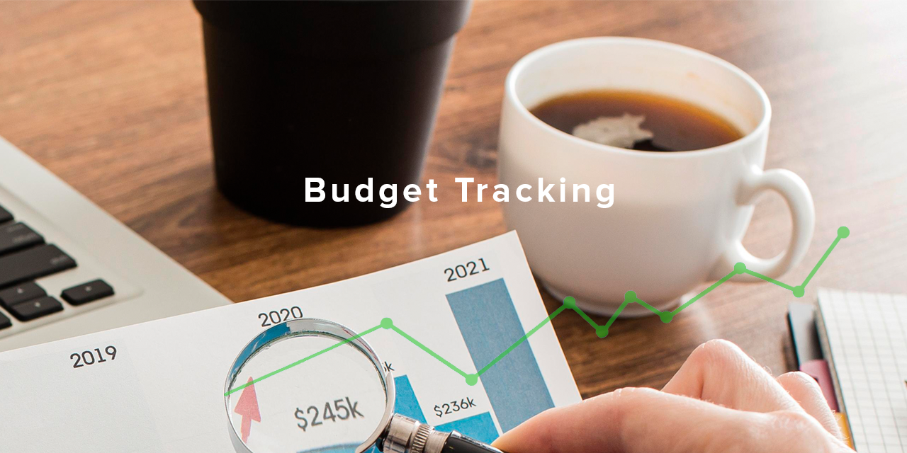

# Budget Tracking



# Table of Contents

- [Budget Tracking](#budget-tracking)
- [Table of Contents](#table-of-contents)
- [Budget Tracking Info](#budget-tracking-info)
- [Used Technology](#used-technology)
- [How to Operate](#how-to-operate)

# Budget Tracking Info

<p align="justify">The Budget tracking application allows you to track your budget.It has the chance to examine the data in a better way by visualizing the data with graphics.</p>

# Used Technology

1. Next.js
2. MongoDB
3. Tailwind.css
4. React Icons
5. React Toastify
6. React Chart.js

# How to Operate

<p align="justify">Add an <code>.env</code> file to the main folder inside this project. Write the code to connect to MongoDB in the <code>.env </code> file. The project will run smoothly after the relevant packages are installed <br>

```bash
npm install
```

<br>

````bash
yarn add
````

<br>

````bash
pnpm instal
````

<br>

````bash
bun install
````

<br>
By selecting any of them you can complete the installation of the project.
</p>

